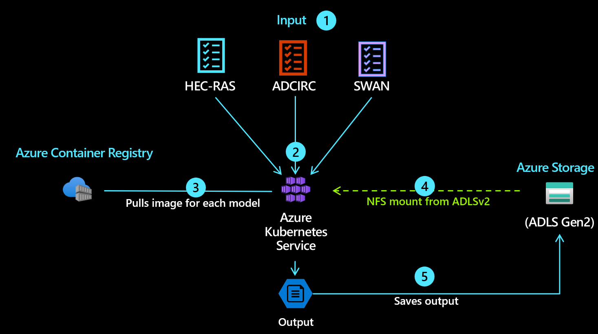

# Project-Stormbreaker

Running simulation models on Azure Kubernetes Services.

<p align="center"></p>

## Target Audience
The target audience for this pattern is anyone that is looking for a deployment of ADCIRC/SWAN on Azure Kubernetes Services. This example uses Terraform as the Infrastructure as Code.

ADCIRC:

The Advanced Circulation Model for Coastal Planning (ADCIRC) is a powerful computing program used for predicting water levels and currents in coastal areas. It's applied in a variety of areas, including storm surge predictions, tide predictions, and coastal circulation patterns. It uses a system of equations based on fluid dynamics and thermodynamics to simulate the behavior of water in these regions.

For example, if a city planner wants to understand how a new pier might impact local currents, ADCIRC could be used to simulate the water movement around the proposed structure, thereby aiding in informed decision-making.

HEC-RAS:

The Hydrologic Engineering Center's River Analysis System (HEC-RAS) is a software developed by the U.S. Army Corps of Engineers. It's used for simulating the flow of water in rivers, channels, and other bodies of water for purposes such as floodplain management, dam break studies, and bridge design.

For instance, an engineer might use HEC-RAS to model how a proposed dam could impact the flow of water in a river, which could help predict potential flooding or ecological impacts.

Running ADCIRC with SWAN:

Simulating WAves Nearshore (SWAN) is a third-generation wave model that computes random, short-crested wind-generated waves in coastal regions and inland waters. ADCIRC can be run with SWAN to provide a more comprehensive and accurate analysis of coastal and marine environments. For instance, this integration can be used to simulate storm surge and wave propagation during a hurricane, providing critical data for emergency planning and response.

ADCIRC in Parallel for Hurricane Simulations:

ADCIRC can be run in parallel to speed up computation time, which is especially useful when simulating complex events like hurricanes. This involves dividing the computational work among multiple processors.

For example, during [Hurricane Gustav](https://en.wikipedia.org/wiki/Hurricane_Gustav), ADCIRC was used in parallel to quickly provide accurate storm surge forecasts. These forecasts played a crucial role in informing evacuation plans and emergency responses, potentially saving lives and property.

## Components of this solution



 - [x] [Azure Kubernetes Services](https://learn.microsoft.com/en-us/azure/aks/)
 - [x] [Azure Data Lake Storage Gen2 with HNM and NFSv3](https://learn.microsoft.com/en-us/azure/storage/blobs/storage-feature-support-in-storage-accounts)
 - [x] [Azure Container Registry](https://learn.microsoft.com/en-us/azure/container-registry/)
 - [x] [Azure CNI Overlay mode](https://learn.microsoft.com/en-us/azure/aks/configure-azure-cni)
 - [x] [Azure Monitor managed service for Prometheus](https://learn.microsoft.com/en-us/azure/azure-monitor/essentials/prometheus-metrics-overview)
 - [x] [Azure Managed Grafana](https://learn.microsoft.com/en-us/azure/managed-grafana/overview)

### Before You Begin
You might need to run az login before running the commands on this demo. Check if you have connectivity to Azure before proceeding by executing az account list and verifying that you have access to an active Azure subscription.

Other components:
* A [Github](https://github.com/) account
* An [Azure](https://azure.microsoft.com/) account
* The Terraform [binary](https://www.terraform.io/downloads.html)
* Azure CLI 2.0 (more instructions below)
* jq


Another option is to use the Cloud Shell on Azure. Cloud shell will have all of the utilities you need already baked in it. If you want to use cloud shell, take a look at [https://shell.azure.com](https://shell.azure.com) and proceed from there.

### Installing the Microsoft Azure CLI

Follow the Azure CLI 2.0 [documentation](https://docs.microsoft.com/en-us/cli/azure/install-azure-cli) to install the `az` command line utility. You can install utility in various platforms such as macOS, Windows, Linux (various distros) and as a Docker container.

The examples here are based on the version 2.48.1 of the utility. You can verify the version of the tool by running:

```
az --version
```

Before we can use Azure, your first step, aside from having an account, is to login. Once Azure CLI is installed, open up a terminal and run the following:

```
az login
```

This will prompt you to sign in using a web browser to https://aka.ms/devicelogin and to enter the displayed code. This single step is needed in order to allow `az` to talk back to Azure.

## Steps to run this demo

The first thing you should do is to clone this repo as most of the examples here will do relative reference to files.
 
Before we proceed, please do this now:

1. Clone this repo:
    ```bash
    git clone https://github.com/appdevgbb/Project-Stormbreaker
    ```
1. If you are using VS Code, install the Terraform [extension](https://marketplace.visualstudio.com/items?itemName=HashiCorp.terraform).
2. Install or check if `jq`, `terraform` and `az-cli` are installed on your system.


### To install the full solution:

1. Copy the `terraform.tfvars.example` to `terraform.tfvars` 
    ```bash
    cp terraform.tfvars.example terraform.tfvars
    ```

1. change the values of `prefix`, `location` and `admin_username`.

    ```terraform
    prefix = "gbb"
    location = "westus3"
    admin_username = "gbbadmin"
    ```

2. Run:

    ```bash
    cd default
    ./run.sh -x install
    ```

### To remove the entire deployment:

1. Run:

    ```bash
    ./run.sh -x delete
    ```

### To install only the demo
1. Run:

    ```bash
    ./run.sh -x demo
    ```

Usage:

```bash
$ ./run.sh 
usage: run.sh [options]
Available Commands:
    [-x  action]        action to be executed.

    Possible verbs are:
        install         creates all of the resources in Azure and in Kubernetes
        demo            deploy the scripts for the demo
        destroy         deletes all of the components in Azure plus any KUBECONFIG and Terraform files
        show            shows information about the demo environment (e.g.: connection strings)
```
